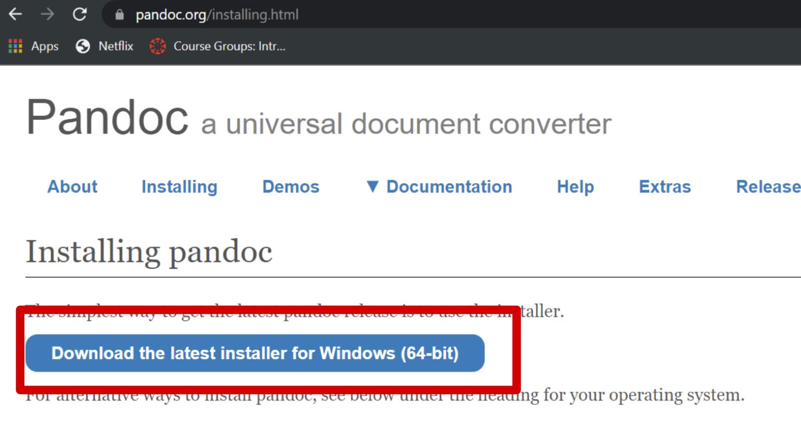
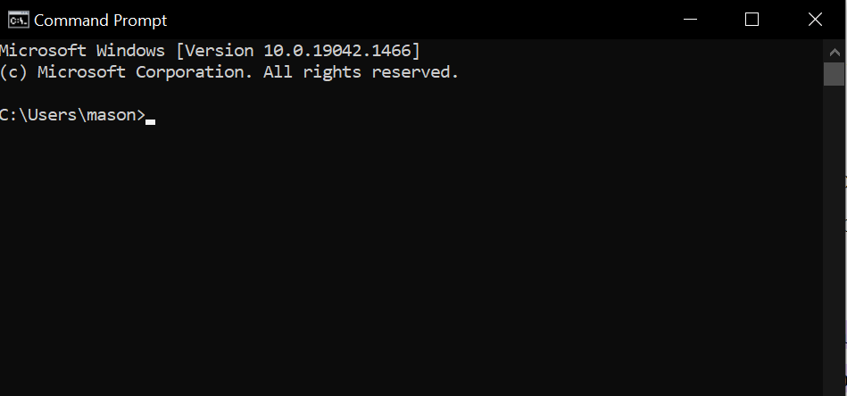
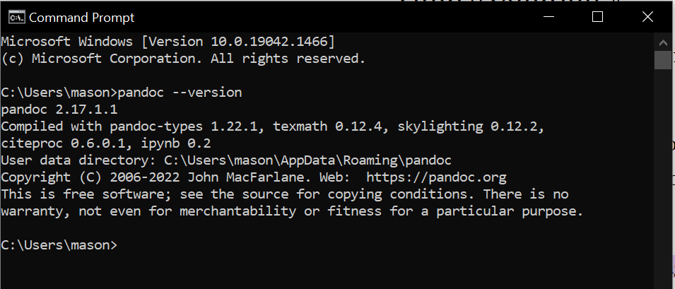

# How to Install Pandoc

This portion of the guide is centered around downloading & installing Pandoc from their central page. Pandoc is essential to the other parts of this documentation. At the end of this section, you will have Pandoc succesfully installed on your computer.

## Beginning the Download ##

1.
    Click on the following link to navigate to Pandocs central page, where the button to download is located.
        [Pandoc Central Page](https://pandoc.org/installing.html)

2.  Press on the **"Download the Latest Installer"** button at the top of the page. This button is pictured and circled in the image below
        

3. Follow the steps that the installer provides you. (Mostly clicking *"Next"* or *"Ok"*)

4. Open your command prompt. The command prompt can be found by typing **"cmd"** into your Windows search bar. It should look similar to the image below once opened.
        
5. Type **"pandoc --version"** into your command prompt and press enter.

        Be VERY careful about the line above, as it must be typed EXACTLY in order to work properly!
        
Afterwards, the command prompt should look similar to the image below.

**Congratulations!** You have succesfully installed Pandoc!

Back to [the home page](index.md)
