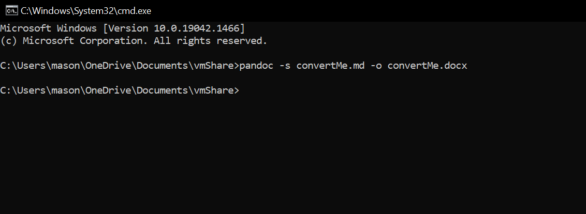

# How to Convert Markdown Files to Word using Pandoc

This portion of the documentation is meant to guide you through the process of converting a Markdown file to Word. At the end of this process you will have the knowledge necessary to effortlessly make this conversion in the future.

## Converting the File ##

1. Open your **File Explorer** and locate the Markdown file that you would like to convert to Word. Your screen should look similar to the image below (where the *"convertMe"* file is YOUR file).
    

2. Click on the **Path** of your current directory in your file explorer. This can be located directly above the files shown, and is circled in the image below.
    

        Depicted in the image above, the path will be highlighted once you click on it.

3. Type **"cmd"** over your highlighted path. Once it is highlighted from the previous step, all you must do is begin typing. Once this is complete, your screen should look similar to the image below.
    

4. Press **enter**. This will open the command prompt at the directory that you were in during the File Explorer session. Once this is complete, your screen should look similar to the image below.
    
    Awesome! Now we are in the directory that we need to be in in order to succesfully use Pandoc.

5. Type the following into the command prompt. **NOTE** that you must replace *"convertMe"* with the name of the Markdown file that YOU are converting!

        pandoc -s convertMe.md -o convertMe.docx
   
   Be VERY careful about the line above, as it must be typed EXACTLY (barring the name of the file) in order to work properly!

6. Press **enter**. Your screen should look similar to the image below.
    

7. Open file explorer and check the location of where your Markdown file was. There should now be a Word file with the same name! If successful, your file explorer should look similar to the image below.
    

**Congratulations!** You have succesfully converted a file from Markdown to Word!

Back to [the home page](index.md)
